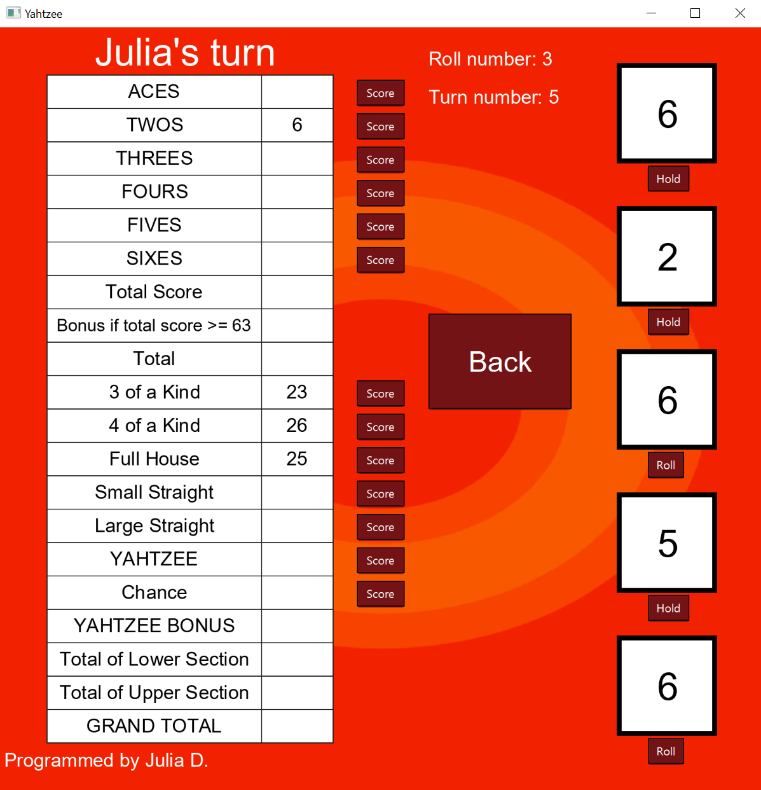

# Yahtzee_Clone
This project is a recreation of Yahtzee, a classic family-time game. The project is programmed entirely in Java/JavaFX from scratch.   
Features included in this project are:
- Interactive GUI with multiple screens
- Automatic score calculation
- Multiplayer support (up to 4 players)
- Turn and roll tracking

This implementation was built under the assumption that the player(s) already know how to play Yahtzee. If you do not know how to play, then you can skip to the **Rules** section to learn how.  

## GUI Showcase
In this section, screenshots of the software at various points in gameplay are displayed.

### Title screen

### Select number of players

### Rolling during turn

### Scoring after turn

### End of game

## Rules
There are 13 turns in Yahtzee for each player. During their turn, players roll the dice up to 3 times to try to score points in one of the categories on the scorecard. All the dice must be rolled on the first roll. For the second and third rolls, players can select which dice to keep and reroll. By the time the dice are rolled 3 times, a player must score something on their card, even if it is 0 points. Although a player can also score points after their first or second rolls if they wish. When scoring, a category can be scored upon only once. After everyone has scored in all 13 categories, the scores are calculated for each player. The player with the highest score overall wins.

### Scoring
In Yahtzee, scoring is broken up into two sections: upper and lower. There are different rules for scoring amongst the categories for both sections, which will be discussed here. The scoring calculations for each categories are done by the software for the player. At the end of the game, the total scores from these sections are summed together to determine a player's grand total score.

#### Upper Section
There are 6 categories in the upper section.
- Aces: Add up all the ones on the dice.
- Twos: Add up all the twos on the dice.
- Threes: Add up all the threes on the dice.
- Fours: Add up all the fours on the dice.
- Fives: Add up all the fives on the dice.
- Sixes: Add up all the sixes on the dice.

At the end of the game, when all six of the categories are scored, the game will calculate the total score for the upper section, and apply the bonus if applicable. To get the 35-point bonus in the upper section, the total of the six categories must be equal to or greater than 63. Otherwise, the player does not get the bonus.

#### Lower Section
There are 7 categories in the lower section.
- Three of a Kind: If there are three or more of the same number on the dice, add the total of all five dice.
- Four of a Kind: If there are four or more of the same number on the dice, add the total of all five dice.
- Full House: If there is three of the same number and a pair of the same number (but different from the three of a kind), score 25 points.
- Small Straight: If a sequence of 4 can be found in the dice, score 30 points.
- Large Straight: If a sequence of 5 can be found in the dice, score 40 points.
- Yahtzee: If you get a five of a kind, score 50 points.
- Chance: Add the total of all five dice.

At the end of the game, when all seven categories are scored, the game will calculate the total score for the lower section, and apply any Yahtzee bonuses if applicable. For each additional Yahtzee after the inital one scoring 50 points, the game will add 100 points to the total of the lower section score (even if the Yahtzee is used to score a category in the upper section). Throughout the game, the program keeps track of additional yahtzees for each player. If Yahtzees occur after a player has already marked 0 points for the Yahtzee category, they will not get any yahtzee bonuses. 
